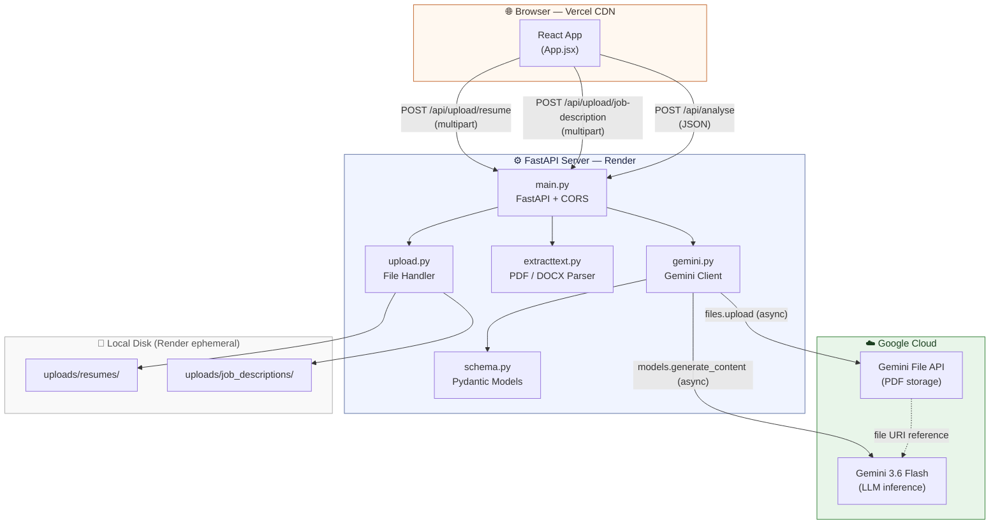
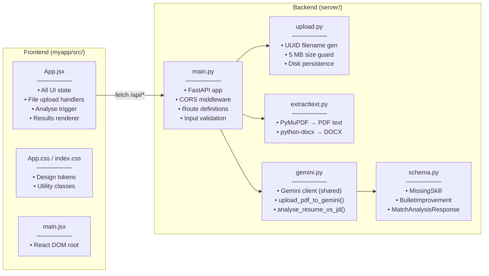
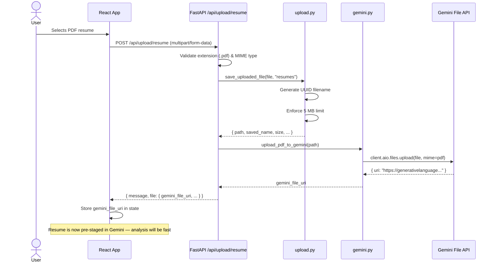
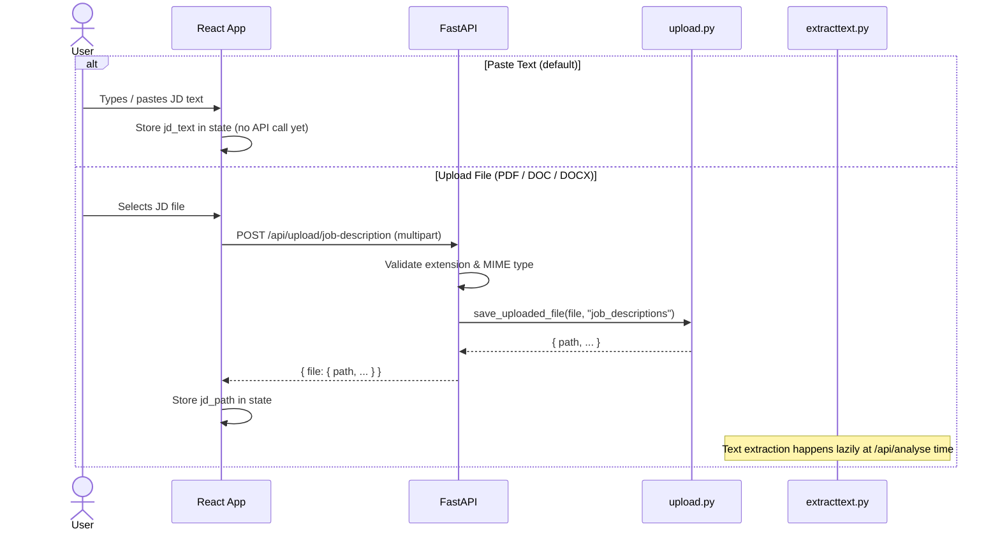
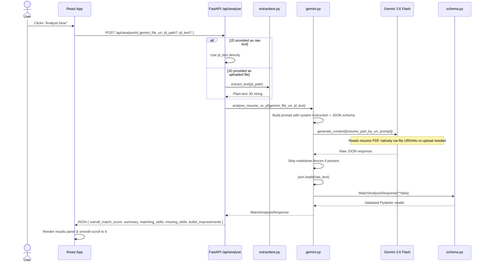
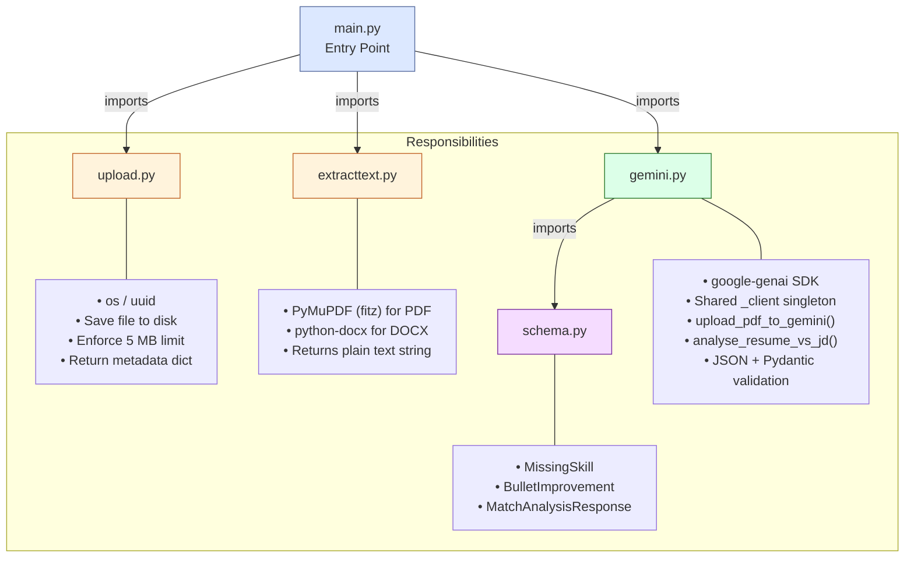
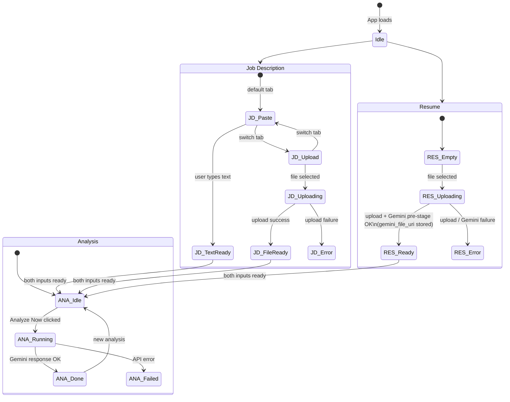
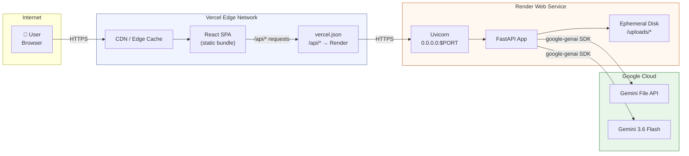

# OptiMore.ai — Architecture Documentation

> AI-powered resume analyser built on React + FastAPI + Google Gemini.

---

## Table of Contents

1. [System Overview](#1-system-overview)
2. [High-Level Architecture](#2-high-level-architecture)
3. [Component Breakdown](#3-component-breakdown)
4. [Data Flow Diagrams](#4-data-flow-diagrams)
   - [Resume Upload Flow](#41-resume-upload-flow)
   - [Job Description Flow](#42-job-description-flow)
   - [Analysis Flow](#43-analysis-flow)
5. [Backend Module Map](#5-backend-module-map)
6. [Frontend State Machine](#6-frontend-state-machine)
7. [API Contract](#7-api-contract)
8. [Deployment Topology](#8-deployment-topology)
9. [Key Design Decisions](#9-key-design-decisions)

---

## 1. System Overview

OptiMore.ai is a two-tier, full-stack web application:

| Tier | Technology | Host |
|---|---|---|
| **Frontend** | React 19 + Vite 8, Vanilla CSS | Vercel |
| **Backend** | Python 3.11, FastAPI, Uvicorn | Render |
| **AI Inference** | Google Gemini 3.6 Flash (`google-genai` SDK) | Google Cloud |

The key architectural insight is an **async-first, split-upload pipeline**: the resume PDF is streamed to the Gemini File API at file-drop time (not at analysis time), so the final analysis call is nearly instant from the user's perspective.

---

## 2. High-Level Architecture



---

## 3. Component Breakdown



---

## 4. Data Flow Diagrams

### 4.1 Resume Upload Flow



### 4.2 Job Description Flow



### 4.3 Analysis Flow



---

## 5. Backend Module Map



---

## 6. Frontend State Machine



---

## 7. API Contract

### `GET /`
Health check.
```json
{ "status": "FastAPI server running!" }
```

---

### `POST /api/upload/resume`
Upload a PDF resume. The file is immediately forwarded to the Gemini File API.

**Request:** `multipart/form-data` — field `file` (PDF only, max 5 MB)

**Response `200`:**
```json
{
  "message": "Resume uploaded successfully",
  "file": {
    "original_name": "john_doe_resume.pdf",
    "saved_name": "a3f9...hex.pdf",
    "path": "/app/server/uploads/resumes/a3f9...hex.pdf",
    "size": 204800,
    "content_type": "application/pdf",
    "gemini_file_uri": "https://generativelanguage.googleapis.com/v1beta/files/..."
  }
}
```

**Errors:** `400` (wrong type) · `413` (> 5 MB) · `503` (Gemini upload failed)

---

### `POST /api/upload/job-description`
Upload a PDF, DOC, or DOCX job description. Text is extracted lazily at analyse time.

**Request:** `multipart/form-data` — field `file` (PDF/DOC/DOCX, max 5 MB)

**Response `200`:**
```json
{
  "message": "Job description uploaded successfully",
  "file": {
    "original_name": "jd_software_engineer.pdf",
    "saved_name": "b7c2...hex.pdf",
    "path": "/app/server/uploads/job_descriptions/b7c2...hex.pdf",
    "size": 102400,
    "content_type": "application/pdf"
  }
}
```

**Errors:** `400` (wrong type) · `413` (> 5 MB)

---

### `POST /api/analyse`
Run the ATS match analysis.

**Request body:**
```json
{
  "gemini_file_uri": "https://generativelanguage.googleapis.com/v1beta/files/...",
  "jd_path": "/app/server/uploads/job_descriptions/b7c2...hex.pdf",
  "jd_text": null
}
```
> Provide either `jd_path` (uploaded file) **or** `jd_text` (pasted text) — not both.

**Response `200` (`MatchAnalysisResponse`):**
```json
{
  "overall_match_score": 74,
  "summary": "Strong Python background with solid FastAPI experience...",
  "matching_skills": ["Python", "FastAPI", "REST APIs", "PostgreSQL"],
  "missing_skills": [
    {
      "skill": "Kubernetes",
      "importance": "High",
      "recommendation": "Obtain CKA certification or add a k8s side-project."
    }
  ],
  "bullet_improvements": [
    {
      "original_text": "Built REST APIs using Flask.",
      "improved_text": "Architected and deployed production-grade REST APIs with FastAPI...",
      "reasoning": "JD emphasises FastAPI and production deployment experience."
    }
  ]
}
```

**Errors:** `400` (bad input) · `500` (invalid Gemini JSON) · `503` (Gemini API failure)

---

## 8. Deployment Topology



### Environment Variables

| Location | Variable | Purpose |
|---|---|---|
| `server/.env` | `GEMINI_API_KEY` | Authenticates `google-genai` SDK |
| `server/.env` | `ALLOWED_ORIGINS` | Comma-separated CORS whitelist |
| `myapp/.env` | `VITE_BACKEND_URL` | Backend base URL (empty = Vite proxy in dev) |

> **Local dev:** `VITE_BACKEND_URL` is left empty — `vite.config.js` proxies `/api/*` to `http://localhost:8000`, so no CORS issues arise.

---

## 9. Key Design Decisions

| Decision | Rationale |
|---|---|
| **Pre-stage resume at upload time** | Eliminates the biggest latency bottleneck. Gemini File API upload can take seconds; doing it eagerly while the user fills in the JD makes the final "Analyze" click feel instant. |
| **Gemini File API (PDF native)** | Gemini reads the actual PDF formatting and layout rather than extracted plain text, producing higher-quality ATS analysis. |
| **Structured JSON output enforced in prompt** | The prompt includes an explicit JSON schema and `response_mime_type="application/json"` to minimise hallucinated structure. A Pydantic model is then used for strict validation. |
| **Single shared `_client` singleton** | `genai.Client` is created once at module load in `gemini.py` and reused across all requests — avoids repeated auth/handshake overhead. |
| **`async/await` everywhere** | All I/O paths (file reads, Gemini SDK calls) use `await` to keep the FastAPI event loop non-blocking under concurrent requests. |
| **Environment-based CORS** | `ALLOWED_ORIGINS` is read from `.env` at startup — no hardcoded URLs, safe for multi-environment deploys (local → staging → production). |
| **UUID filenames** | Uploaded files are renamed to `uuid4().hex + ext` to prevent filename collisions and path traversal attacks. |
| **Graceful HTML error stripping** | The frontend `parseErrorResponse()` utility strips HTML tags from Render cold-start error pages so users see readable messages rather than raw HTML. |
