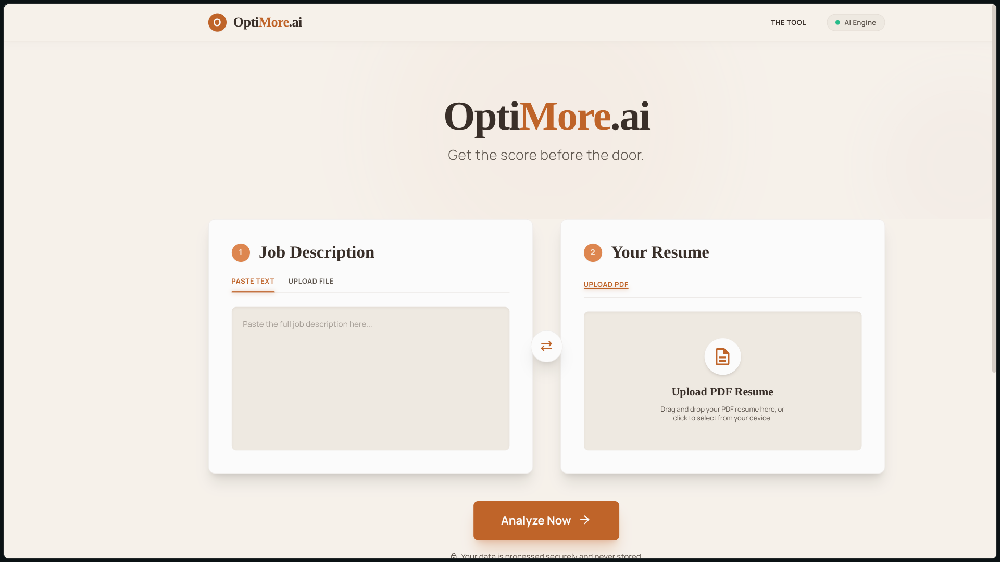

# OptiMore.ai — AI-Powered Resume Analyser

> **Get the score before the door.**  
> Instantly analyse how well your resume matches a job description using Google Gemini AI.

🔗 **Live Demo:** [opti-more.vercel.app](https://opti-more.vercel.app)



---

## Overview

OptiMore.ai is a full-stack AI web application that compares a candidate's resume against a job description and produces an ATS-style match report — including a score, skill gap analysis, and AI-rewritten bullet points optimised for the role.

Built and deployed end-to-end: React frontend on Vercel, FastAPI backend on Render, and Google Gemini 3.6 Flash as the inference engine.

---

## Features

- 📄 **Resume upload** — accepts PDF, streamed directly to Google Gemini File API
- 📋 **Job description input** — paste text or upload a PDF/DOCX file
- 🤖 **AI Match Analysis** powered by Gemini 3.6 Flash:
  - Overall match score (0–100)
  - Executive summary of fit
  - Matching skills detected in both documents
  - Missing skills ranked by importance (High / Medium / Low) with recommendations
  - Up to 5 AI-rewritten bullet points optimised for the specific role's language
- ⚡ **Async pipeline** — resume is uploaded to Gemini at file-drop time, so analysis is near-instant when triggered
- 🌐 **Production deployed** — frontend on Vercel, backend on Render with environment-based CORS

---

## Tech Stack

| Layer | Technology |
|---|---|
| **Frontend** | React 19, Vite 8, Vanilla CSS |
| **Backend** | Python 3.11, FastAPI, Uvicorn |
| **AI / LLM** | Google Gemini 3.6 Flash (`google-genai` SDK) |
| **File Parsing** | PyMuPDF (PDF), python-docx (DOCX) |
| **Deployment** | Vercel (frontend), Render (backend) |
| **Config** | Environment variables, `python-dotenv` |

---

## Architecture

```text
Browser (Vercel)
    │
    ├─ POST /api/upload/resume      ──►  FastAPI (Render)
    │       └─ File streamed to Gemini File API → returns gemini_file_uri
    │
    ├─ POST /api/upload/job-description  ──►  FastAPI (Render)
    │       └─ Text extracted from PDF/DOCX → returned to client
    │
    └─ POST /api/analyse            ──►  FastAPI (Render)
            └─ Gemini 3.6 Flash reads resume by URI + JD text
               → structured JSON response (score, skills, rewrites)
```

> 📖 For full sequence diagrams, module maps, and state-machine docs see [`docs/architecture.md`](docs/architecture.md).

---

## API Reference

### Endpoints

| Method | Endpoint | Description |
|---|---|---|
| `GET` | `/` | Health check |
| `POST` | `/api/upload/resume` | Upload PDF resume → pre-stages it in Gemini File API |
| `POST` | `/api/upload/job-description` | Upload PDF/DOC/DOCX job description |
| `POST` | `/api/analyse` | Run ATS match analysis — returns scored JSON report |

### Example: `POST /api/analyse`

**Request body:**
```json
{
  "gemini_file_uri": "https://generativelanguage.googleapis.com/v1beta/files/abc123",
  "jd_text": "We are looking for a Senior Python Engineer with FastAPI, PostgreSQL..."
}
```

**Response `200`:**
```json
{
  "overall_match_score": 74,
  "summary": "Strong Python background with solid FastAPI experience. Missing cloud-native skills (Kubernetes, Terraform) that are high-priority for this role.",
  "matching_skills": ["Python", "FastAPI", "REST APIs", "PostgreSQL", "Docker"],
  "missing_skills": [
    {
      "skill": "Kubernetes",
      "importance": "High",
      "recommendation": "Obtain CKA certification or contribute a k8s side-project to demonstrate operational experience."
    },
    {
      "skill": "Terraform",
      "importance": "Medium",
      "recommendation": "Complete the HashiCorp Terraform Associate learning path and provision a small cloud environment."
    }
  ],
  "bullet_improvements": [
    {
      "original_text": "Built REST APIs using Flask.",
      "improved_text": "Architected and deployed production-grade REST APIs with FastAPI, serving 50k+ daily requests with p99 latency under 120ms.",
      "reasoning": "JD emphasises FastAPI and quantifiable production impact; original bullet lacked both."
    }
  ]
}
```

**Error responses:**

| Status | Cause |
|---|---|
| `400` | Wrong file type, missing JD input, or failed text extraction |
| `413` | File exceeds the 5 MB limit |
| `500` | Gemini returned unparseable JSON |
| `503` | Gemini API unreachable or upload failed |

---

## Supported Formats & Limits

| Input | Accepted formats | Max size |
|---|---|---|
| **Resume** | PDF only | 5 MB |
| **Job Description** | PDF, DOC, DOCX, or plain text paste | 5 MB (file) |

### Known Limitations

- **Resume format only:** DOCX and plain-text resumes are not supported — PDF only.
- **Gemini File API TTL:** Uploaded files are automatically deleted by Google after ~48 hours. Refreshing the page after that period requires re-uploading the resume.
- **Render free tier cold starts:** The backend spins down after ~15 minutes of inactivity. The **first request after idle may take 30–60 seconds** while the container wakes up. Subsequent requests are fast. See the [cold-start note](#-cold-start-on-render-free-tier) below.
- **Single-user sessions:** There is no authentication or session management; the `gemini_file_uri` is held in browser state only.
- **JD text length:** Extremely long job descriptions (>10,000 words) may be truncated by the model's context window.

---

## ⚠️ Cold Start on Render Free Tier

The backend is hosted on Render's **free tier**, which spins down the container after ~15 minutes of inactivity.

- **First request after idle:** expect a **30–60 second delay** while Render wakes the service.
- **Subsequent requests:** respond normally (< 3 s for upload, < 10 s for Gemini analysis).
- The frontend surfaces a readable error message if the cold-start response is an HTML error page.

To avoid cold starts in production, upgrade to a Render paid plan or add a scheduled ping (e.g. UptimeRobot every 10 minutes).

---

## 🔒 Privacy & Data Handling

- **No user accounts or persistent storage.** No login is required and no personal data is stored in a database.
- **Files are written to Render's ephemeral disk** (`server/uploads/`) under a UUID filename and are deleted whenever the Render container restarts.
- **Resumes are forwarded to the Google Gemini File API** for AI inference. Files are subject to [Google's data usage policies](https://ai.google.dev/gemini-api/terms). Uploaded files are automatically deleted by Google within 48 hours.
- **Job description text** is sent to the Gemini API as part of the analysis prompt and is not retained after the request completes.
- **No analytics or tracking** are embedded in the frontend beyond what Vercel's own infrastructure logs.

---

## Local Development

### Prerequisites
- Node.js 18+
- Python 3.11+
- A Google Gemini API key ([get one free](https://aistudio.google.com/app/apikey))

### Backend

```bash
cd server
python -m venv .venv && source .venv/bin/activate
pip install -r requirements.txt

# Create server/.env
echo "GEMINI_API_KEY=your_key_here" > .env
echo "ALLOWED_ORIGINS=http://localhost:5173" >> .env

uvicorn main:app --reload
# → http://localhost:8000
```

### Frontend

```bash
cd myapp
npm install

# Create myapp/.env
# Leave VITE_BACKEND_URL empty — Vite proxy forwards /api/* to localhost:8000
echo "VITE_BACKEND_URL=" > .env

npm run dev
# → http://localhost:5173
```

---

## Environment Variables

### Backend (`server/.env`)

| Variable | Description |
|---|---|
| `GEMINI_API_KEY` | Google Gemini API key |
| `ALLOWED_ORIGINS` | Comma-separated list of allowed frontend URLs (CORS) |

### Frontend (`myapp/.env`)

| Variable | Description |
|---|---|
| `VITE_BACKEND_URL` | Backend URL (empty for local dev, Render URL for production) |

---

## Deployment

### Backend → Render
1. Connect the GitHub repo to a new **Web Service** on [render.com](https://render.com)
2. Set **Root Directory** to `server/`
3. **Build command:** `pip install -r requirements.txt`
4. **Start command:** `uvicorn main:app --host 0.0.0.0 --port $PORT`
5. Add environment variables: `GEMINI_API_KEY`, `ALLOWED_ORIGINS`

### Frontend → Vercel
```bash
cd myapp
vercel --prod
```
Set `VITE_BACKEND_URL=https://<your-render-service>.onrender.com` in the Vercel dashboard.

---

## Project Structure

```text
opti-more/
├── server/
│   ├── main.py          # FastAPI app, CORS, route definitions
│   ├── upload.py        # File upload handler (size validation, UUID naming)
│   ├── extracttext.py   # Text extraction from PDF/DOCX
│   ├── gemini.py        # Gemini File API upload + analysis prompt
│   ├── schema.py        # Pydantic response models
│   └── requirements.txt
│
├── myapp/
│   ├── src/
│   │   ├── App.jsx      # Main React component (upload, analyse, results)
│   │   └── App.css      # Styles
│   ├── vite.config.js   # Vite config with dev proxy
│   └── vercel.json      # Vercel deployment config
│
└── docs/
    ├── architecture.md  # Full architecture diagrams and API contract
    └── screenshot.png   # App screenshot
```

---

## Key Implementation Details

- **Async-first backend:** All I/O — file reads, Gemini API calls — are `async/await`, keeping the FastAPI event loop non-blocking.
- **Gemini File API:** Resumes are uploaded as native PDF parts, not extracted text, so Gemini reads the actual formatting and layout.
- **Structured output:** The Gemini prompt enforces a strict JSON schema, and the response is validated through a Pydantic model before being returned to the client.
- **Environment-based CORS:** Allowed origins are read from an env variable at startup — no hardcoded URLs, safe for multi-environment deploys.
- **Graceful error handling:** Non-JSON error responses (HTML error pages from proxies/cold starts) are stripped and surfaced as readable messages.

---

## License

MIT © 2026 OptiMore.ai
